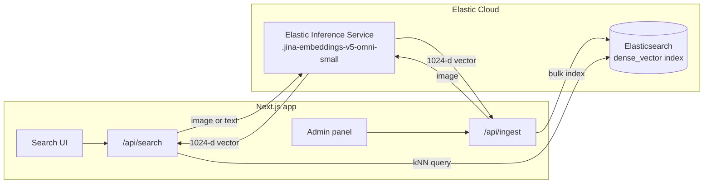

<div align="center">

# Image Search

**Reverse image search powered by Elastic.** Upload a photo or describe one in words, and find the most similar images in your library.

Built with Elasticsearch kNN, Jina embeddings v5 omni on the Elastic Inference Service, and Elastic UI.

[](LICENSE)
[](https://www.elastic.co/elasticsearch)
[](https://nextjs.org)
[](https://www.typescriptlang.org)
[](https://eui.elastic.co)

</div>

---

## Features

- 🖼️ **Search by image**: drop in a photo and get visually similar images back.
- 📷 **Camera search**: take a photo in the browser and search with it. The front (selfie) camera opens first.
- 💬 **Search by text**: describe what you're looking for ("man in a blue suit on stage").
- 🔁 **Find similar**: jump from any result to images like it.
- 🔐 **Admin panel**: password-protected bulk upload, with duplicate detection and progress tracking.
- 🚦 **Rate limiting**: per-visitor search limits, which you can turn on or off and tune from the admin panel.
- 🌗 **Dark mode**: follows your system theme, with a one-click toggle.
- 📱 **Mobile friendly**: works on phones and tablets as well as desktop.
- ☁️ **Nothing extra to host**: embeddings come from Elastic Cloud's managed `.jina-embeddings-v5-omni-small` endpoint, so there are no GPUs, model servers or third-party API keys.

## How it works



1. **Indexing**: each uploaded photo is hashed (SHA-256) to skip duplicates, embedded by Jina embeddings v5 omni (small) on the Elastic Inference Service, and stored in a `dense_vector` field (cosine similarity, HNSW).
2. **Searching**: the query photo or text is embedded into the same vector space, and Elasticsearch runs an approximate kNN search to return the nearest images.

Because the model puts images and text in one shared space, the same index serves both image-to-image and text-to-image search.

> [!NOTE]
> The model finds _visually_ similar photos: the same scene, clothing or look. It doesn't do face recognition.

## Quick start

### Prerequisites

- [Node.js](https://nodejs.org) 20 or later
- An [Elastic Cloud](https://cloud.elastic.co/registration) deployment or Serverless project. The `.jina-embeddings-v5-omni-small` inference endpoint comes preconfigured.
- An Elasticsearch [API key](https://www.elastic.co/docs/deploy-manage/api-keys/elasticsearch-api-keys)

### Setup

```bash
git clone https://github.com/<your-username>/image-search.git
cd image-search
npm install
cp .env.example .env.local
```

Fill in `.env.local`:

```bash
ES_URL=https://your-project.es.us-central1.gcp.elastic.cloud:443
ES_API_KEY=your-api-key
ADMIN_PASSWORD=choose-a-strong-password
```

Create the index. This also checks that the inference endpoint works:

```bash
npm run setup-index
```

Start the app:

```bash
npm run dev
```

Open **http://localhost:3000/admin** to upload photos, then **http://localhost:3000** to search.

> [!TIP]
> Only `ADMIN_PASSWORD` has to be in `.env.local`. You can leave the Elasticsearch settings out, log in to the admin panel, and enter them on the **Configuration** tab, which can also create the index for you.

## Configuration

Settings come from environment variables (see [`.env.example`](.env.example)), and most of them can also be changed on the admin panel's **Configuration** tab. A value saved in the admin panel overrides the environment variable, and emptying the field goes back to it.

| Variable         | Required     | Default                          | In admin panel | Description                                                     |
| ---------------- | ------------ | -------------------------------- | -------------- | --------------------------------------------------------------- |
| `ES_URL`         | one of these | –                                | yes            | Elasticsearch endpoint URL (Serverless, hosted or self-managed) |
| `ES_CLOUD_ID`    | one of these | –                                | yes            | Cloud ID of an Elastic Cloud hosted deployment                  |
| `ES_API_KEY`     | yes          | –                                | yes            | Elasticsearch API key                                           |
| `ES_INDEX`       | no           | `photos`                         | yes            | Index name                                                      |
| `INFERENCE_ID`   | no           | `.jina-embeddings-v5-omni-small` | yes            | Inference endpoint for image and text embeddings                |
| `STORAGE_DIR`    | no           | `./storage`                      | no             | Where uploaded images are stored                                |
| `ADMIN_PASSWORD` | yes          | –                                | can change     | Password for the admin panel                                    |
| `SESSION_SECRET` | no           | admin password                   | no             | Key for signing admin session cookies                           |
| `DATA_DIR`       | no           | `./data`                         | no             | Where admin panel settings are stored                           |
| `S3_BUCKET`      | no           | –                                | no             | Store images and settings in this S3 bucket instead of on disk  |
| `S3_REGION`      | no           | AWS default                      | no             | Region of `S3_BUCKET`                                           |

`ADMIN_PASSWORD` is always needed to log in the first time. After you change the password in the admin panel, the new one is used for logging in, but sessions are still signed with the `.env` value. `SESSION_SECRET`, `DATA_DIR`, `STORAGE_DIR` and the S3 settings stay in `.env`, because the login check, the settings file and the already stored images depend on them.

> [!WARNING]
> Settings saved in the admin panel, including the API key, are stored in `DATA_DIR/settings.json` (readable by the server's user only), or at `settings/settings.json` in `S3_BUCKET`. Keep that folder out of backups or version control you share.

### Choosing an inference endpoint

`INFERENCE_ID` can point at any Elasticsearch inference endpoint that meets these requirements:

| Requirement             | Why                                                                                                                |
| ----------------------- | ------------------------------------------------------------------------------------------------------------------ |
| `embedding` task type   | The app calls `POST _inference/embedding/<id>`. Endpoints for `text_embedding` or `sparse_embedding` are rejected. |
| Accepts images and text | Photos are sent as base64 images. Text-only models (E5, ELSER, most text embedding APIs) can't embed them.         |
| Returns dense vectors   | Vectors are stored in a `dense_vector` field for kNN. Sparse models such as ELSER don't fit.                       |

In practice this means a multimodal model on the Elastic Inference Service. `.jina-embeddings-v5-omni-small` (the default) and `.jina-clip-v2` have been tested; `.jina-embeddings-v5-omni-nano` is a smaller, faster option.

The vector size is detected automatically: creating the index embeds a test string and sizes the index to match. **Test connection** in the admin panel shows the size each endpoint returns and warns when it doesn't match the index.

### Switching models

Vectors from different models (or different sizes of the same model) aren't comparable, so every photo has to be embedded again.

**Same vector size** (for example `.jina-clip-v2` and `.jina-embeddings-v5-omni-small`, both 1024-d): re-embed in place from the stored images, with no re-uploading.

1. Set `INFERENCE_ID` in `.env.local`, or change **Inference endpoint** on the admin panel's **Configuration** tab.
2. Run `npm run reembed`. With S3 storage, also set `S3_BUCKET`, `S3_REGION` and AWS credentials (such as `AWS_PROFILE`) so it can read the images.
3. Restart or redeploy the app. Searches return poor results between steps 1 and 2.

**Different vector size**: on the **Configuration** tab click **Test connection**, then **Recreate index** (this deletes all indexed vectors), and re-upload your photos. From the command line: `npm run setup-index -- --recreate`.

### Smaller vectors

Some models, such as Jina CLIP v2, support Matryoshka embeddings. To trade a little accuracy for a smaller index, create your own endpoint:

```
PUT _inference/embedding/jina-clip-v2-512
{
  "service": "elastic",
  "service_settings": { "model_id": "jina-clip-v2", "dimensions": 512 }
}
```

Then set `INFERENCE_ID=jina-clip-v2-512` and follow the steps in [Switching models](#switching-models).

## Usage

### Search page (`/`)

- Upload a photo or type a description, then use **Find similar** on any result to search from it.
- **Take a photo** opens the front (selfie) camera, and you can switch to the back camera. Browsers only allow the camera on HTTPS pages or `localhost`.
- Scores are cosine similarity. Photo-to-photo matches usually score 0.5–1.0, and text-to-photo matches around 0.2–0.45, because the model puts text and images in the same space but not on top of each other.
- **Minimum similarity** hides results below a score, without running a new search.

### Admin panel (`/admin`)

- Log in with `ADMIN_PASSWORD`. The session lasts 7 days.
- **Photos** tab: drag and drop photos to index them. Uploads go in batches, and files already in the index are skipped.
- **Configuration** tab (`/admin#configuration`):
  - Change the Elasticsearch connection, index and inference endpoint. **Test connection** checks unsaved changes first, and can create or recreate the index.
  - Turn search rate limiting on or off (this applies immediately) and set the number of searches allowed per minute, hour or day.
  - Change the admin password.

### Rate limiting

When it's on, each visitor IP gets a fixed number of searches per window. Responses include `X-RateLimit-Limit`, `X-RateLimit-Remaining` and `X-RateLimit-Reset` headers. A visitor who goes over the limit gets `429 Too Many Requests` with `Retry-After`, and the UI shows a countdown. Logged-in admins are never limited.

## API

| Method | Route                    | Auth  | Description                                                                                 |
| ------ | ------------------------ | ----- | ------------------------------------------------------------------------------------------- |
| `POST` | `/api/search`            | –     | Form data: `mode` (`image` \| `text` \| `id`), `file` / `text` / `id`, `k`                  |
| `GET`  | `/api/images/:file`      | –     | Serves a stored image                                                                       |
| `POST` | `/api/auth/login`        | –     | JSON `{ "password": "..." }`, sets the session cookie                                       |
| `POST` | `/api/auth/logout`       | –     | Clears the session cookie                                                                   |
| `GET`  | `/api/ingest`            | admin | Number of indexed photos                                                                    |
| `POST` | `/api/ingest`            | admin | Form data: one or more `files`                                                              |
| `GET`  | `/api/admin/settings`    | admin | Current settings                                                                            |
| `PUT`  | `/api/admin/settings`    | admin | JSON `{ "rateLimit": { "enabled", "maxRequests", "windowSeconds" } }`                       |
| `GET`  | `/api/admin/config`      | admin | Current configuration and where each value comes from (no secrets)                          |
| `PUT`  | `/api/admin/config`      | admin | JSON with any of `esEndpoint`, `esApiKey`, `esIndex`, `inferenceId` (`""` resets to `.env`) |
| `POST` | `/api/admin/config/test` | admin | Same body as above, tests the connection without saving                                     |
| `POST` | `/api/admin/index`       | admin | Create the index, or `{ "recreate": true }` to drop and recreate it                         |
| `PUT`  | `/api/admin/password`    | admin | JSON `{ "current": "...", "next": "..." }`                                                  |

Example text search:

```bash
curl -X POST http://localhost:3000/api/search -F mode=text -F text="sunset over the sea"
```

## Project structure

```
├── app/
│   ├── page.tsx               Search page
│   ├── admin/                 Admin panel and login
│   ├── api/                   Route handlers
│   ├── layout.tsx             Root layout (header, footer, theme)
│   └── providers.tsx          EUI provider, SSR styles, color mode
├── components/                EUI components (header, footer, camera, results, settings)
├── lib/
│   ├── embeddings.ts          Elastic Inference Service client
│   ├── es.ts                  Elasticsearch client and index mapping
│   ├── indexer.ts             Dedupe, store, embed and bulk index
│   ├── search.ts              kNN queries
│   ├── auth.ts                Password check and signed session cookie
│   ├── admin-password.ts      Password changed from the admin panel
│   ├── config.ts              Admin panel overrides on top of .env
│   ├── index-setup.ts         Connection test and index creation
│   ├── rate-limit.ts          Per-IP rate limiter
│   ├── settings.ts            Persisted admin settings
│   ├── object-store.ts        Local disk or S3 storage for images and settings
│   └── types.ts               Types shared by the API and the UI
├── middleware.ts              Protects /admin and admin APIs
├── scripts/                  Index setup, re-embedding, Amplify env
└── Dockerfile                 Production container image
```

## Development

| Command                       | Description                                      |
| ----------------------------- | ------------------------------------------------ |
| `npm run dev`                 | Start the dev server                             |
| `npm run build` / `npm start` | Production build and server                      |
| `npm run setup-index`         | Create the index (`-- --recreate` to rebuild it) |
| `npm run reembed`             | Re-embed every photo with the current model      |
| `npm run typecheck`           | Type-check with TypeScript                       |
| `npm run lint`                | Lint with ESLint                                 |
| `npm run format`              | Format with Prettier (`format:check` to verify)  |

CI runs typecheck, lint, format check and build on every push and pull request.

## Docker

The [`Dockerfile`](Dockerfile) builds a small production image with Next.js standalone output. It runs as a non-root user on port 3000.

```bash
docker build -t image-search .
```

```bash
docker run -d --name image-search -p 3000:3000 --env-file .env.local -v image-search-storage:/app/storage -v image-search-data:/app/data image-search
```

- **Settings**: pass them at run time with `--env-file` or `-e`. `.env` files are never copied into the image, and changing `ADMIN_PASSWORD` or `SESSION_SECRET` only needs a container restart, not a rebuild.
- **Volumes**: `/app/storage` holds uploaded images and `/app/data` holds admin settings, including an API key saved in the admin panel. Keep both on volumes so they survive upgrades.
- **Index setup**: with no index yet, open the admin panel's **Configuration** tab and use **Create index**.
- **Networking**: the image makes Node try IPv4 first and wait up to 1 s per address, because Docker networks usually lack IPv6 and distant clusters can take longer than Node's 250 ms default to connect.

## Deploy to AWS Amplify

Amplify runs the server on short-lived functions with no lasting disk, so images and settings go to S3. [`amplify.yml`](amplify.yml) has the build settings.

1. Create a private S3 bucket in the same region as the app.
2. Create an IAM role that `amplify.amazonaws.com` can assume, allowing `s3:GetObject` and `s3:PutObject` on the bucket, and set it as the app's **compute role**.
3. Create the Amplify app from your Git repository, with the **Web Compute** platform.
4. Add the environment variables from the configuration table, including `S3_BUCKET` and `S3_REGION`. Amplify only passes them to the build, so [`scripts/amplify-env.mjs`](scripts/amplify-env.mjs) writes them into `.env.production` for the server.

Each upload request stays under 4 MB, because serverless functions reject request bodies over about 6 MB. Search photos over 1 MB are shrunk in the browser first, but a single admin upload over about 6 MB may be rejected.

## Deployment notes

- **Several instances**: set `S3_BUCKET` so every instance shares images and settings. The rate limiter runs in memory, so on Amplify or behind a load balancer each instance counts separately; move it to a shared store (such as Redis) for strict limits.
- **Security**: use a strong `ADMIN_PASSWORD` and serve the app over HTTPS. Session cookies are `httpOnly`, and `Secure` in production.
- **Rebuild after changing `ADMIN_PASSWORD` or `SESSION_SECRET` in `.env`** (not needed with Docker): `next build` bakes values from `.env` files into the middleware. Changes made in the admin panel apply immediately.

## Contributing

Contributions are welcome.

1. Fork the repo and create a branch: `git checkout -b feature/my-change`
2. Make your changes, then run `npm run typecheck && npm run lint && npm run format:check`
3. Open a pull request that describes what changed and why

For bugs and feature ideas, please open an issue first.

## Acknowledgments

- [Elastic](https://www.elastic.co): Elasticsearch, the Elastic Inference Service and [Elastic UI](https://eui.elastic.co)
- [Jina AI](https://jina.ai): the jina-embeddings-v5-omni and [jina-clip-v2](https://jina.ai/models/jina-clip-v2/) multimodal embedding models

## License

[MIT](LICENSE)

---

<div align="center">
<sub>Powered by <a href="https://www.elastic.co">Elastic</a></sub>
</div>
